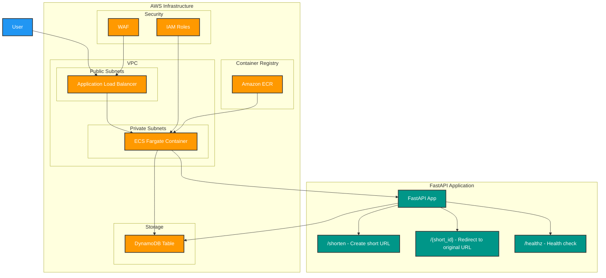

# url-shortener

A serverless URL shortener built with FastAPI and deployed on AWS infrastructure.

## Architecture

## Components

### Application Layer
- **FastAPI**: Web framework handling HTTP requests
- **Docker**: Containerised application deployment
- **ECS Fargate**: Serverless container hosting

### Infrastructure Layer
- **VPC**: Network isolation with public/private subnets
- **Application Load Balancer**: Traffic distribution and SSL termination
- **DynamoDB**: NoSQL database for URL mappings
- **WAF**: Web application firewall for security
- **IAM**: Identity and access management

### API Endpoints
- `POST /shorten`: Creates a shortened URL from the original URL
- `GET /{short_id}`: Redirects to the original URL using the short ID
- `GET /healthz`: Health check endpoint
